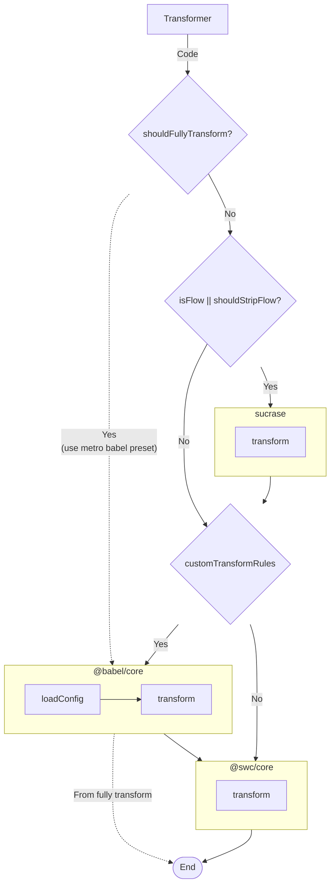
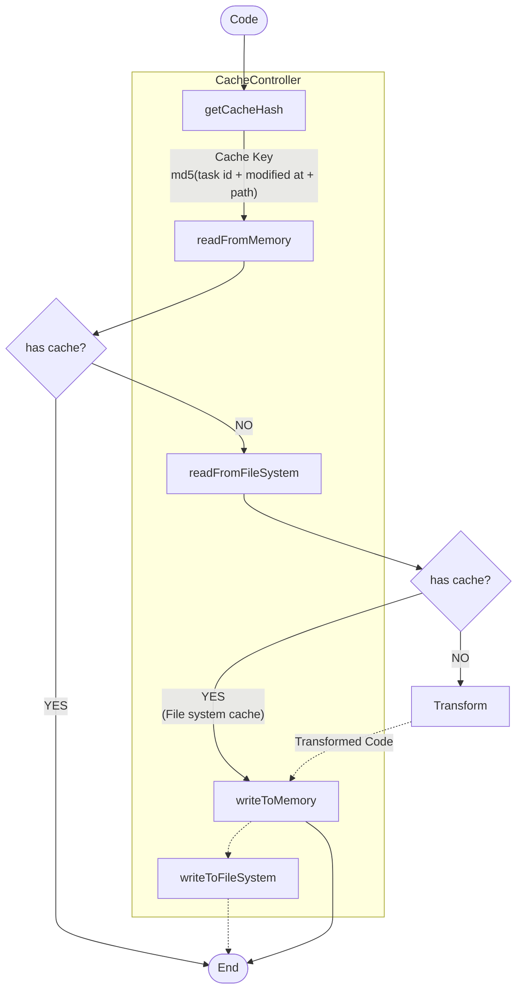

# Architecture

## Transformer

- [esbuild](https://esbuild.github.io): for transform source and bundling (minify, mangle, tree shaking)
- [swc](https://swc.rs): for transform source to es5
- [sucrase](https://github.com/alangpierce/sucrase): for strip flow syntax
- [babel](https://babeljs.io): for transform with plugins

## Caching

