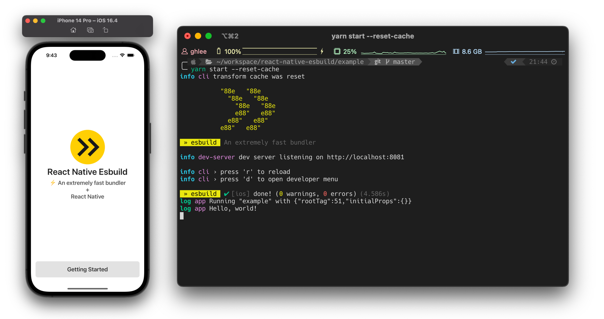

<div align="center">

  # react-native-esbuild

  > ⚡️ An extremely fast bundler + React Native

  

  [](https://esbuild.github.io)
  [](https://swc.rs)
  [](https://reactnative.dev)
  [](https://lerna.js.org)
  [](https://nx.dev)


  [](https://www.npmjs.com/settings/react-native-esbuild/packages)
  [](https://github.com/vercel/style-guide)
  [](https://www.typescriptlang.org)

</div>

# Features

> [!WARNING]
> This project is under development

- ⚡️ Blazing Fast Build
- 🌳 Tree Shaking
- 💾 In-memory & Local File System Caching
- 🎨 Flexible & Extensible
- 🔥 Support Hermes Runtime
- 🔄 Support Live Reload
- 🐛 Support Debugging (Flipper, Chrome Debugger)
- ✨ New Architecture Ready
- ~~🌍 Support Web~~ (WIP)

# Setup

```bash
# using npm
npm install -D install @react-native-esbuild/cli

# using yarn
yarn add -D @react-native-esbuild/cli
```

## Android

Open `android/app/build.gradle` and add configuration.

```diff
// >= 0.71.x
react {
+ cliFile = file("../node_modules/@react-native-esbuild/cli/dist/index.js")
}

// <= 0.70.x
project.ext.react = [
+ cliPath: "../../node_modules/@react-native-esbuild/cli/dist/index.js"
]
```

## iOS

Open XCode, go to `Build Target > Build Phases > Bundle React Native code and images` and add `CLI_PATH` environment variable.

```diff
set -e

+ CLI_PATH="../node_modules/@react-native-esbuild/cli/dist/index.js"

WITH_ENVIRONMENT="../node_modules/react-native/scripts/xcode/with-environment.sh"
REACT_NATIVE_XCODE="../node_modules/react-native/scripts/react-native-xcode.sh"

/bin/sh -c "$WITH_ENVIRONMENT $REACT_NATIVE_XCODE"
```

## Configurations

File location: `<rootDir>/react-native-esbuild.js`

```js
/**
 * @type {import('@react-native-esbuild/core').ReactNativeEsbuildConfig}
 */
exports.default = {};
```

<details>
  <summary>Configuration details</summary>

```ts
interface ReactNativeEsbuildConfig {
  /**
   * Enable cache.
   *
   * Defaults to `true`
   */
  cache?: boolean;
  /**
   * Field names for resolve package's modules.
   *
   * Defaults to `['react-native', 'browser', 'main', 'module']`
   */
  mainFields?: string[];
  /**
   * Logger configurations
   */
  logger?: {
    /**
     * Enable client log.
     *
     * Defaults to `true`
     */
    enabled?: boolean;
    /**
     * Print timestamp with log when format is specified.
     *
     * Defaults to `null`
     */
    timestamp?: string | null;
  };
  /**
   * Transformer configurations
   */
  transformer?: {
    /**
     * If `true`, convert svg assets to `react-native-svg` based component
     */
    convertSvg?: boolean;
    /**
     * Strip flow syntax.
     *
     * Defaults to `['react-native']`
     */
    stripFlowPackageNames?: string[];
    /**
     * Transform with babel using `metro-react-native-babel-preset` (slow)
     */
    fullyTransformPackageNames?: string[];
    /**
     * Additional transform rules. This rules will be applied before phase of transform to es5.
     */
    additionalTransformRules?: {
      /**
       * Custom Babel rules
       */
      babel?: CustomTransformRuleBase<BabelTransformOptions>[];
      /**
       * Custom Swc rules
       */
      swc?: CustomTransformRuleBase<SwcTransformOptions>[];
    };
  };
}
```
</details>

> [!IMPORTANT]  
> If you've some issues on build, go to troubleshooting guide

- [TROUBLESHOOTING.md](./TROUBLESHOOTING.md)

# Commands

## Start

Launch dev server

```bash
rne start
```

| Option | Description | Default value |
|:--|:--|:--|
| `--entry-file` | entry file path | `index.js` |
| `--host` | dev server host | `localhost` |
| `--port` | dev server port | `8081` |
| `--verbose` | show cli debug log | `false` |
| `--reset-cache` | reset transform cache | `false` |

## Bundle

Build bundle

```bash
rne bundle --platform=<platform> --bundle-output=<dest>
```

| Option | Description | Default value |
|:--|:--|:--|
| `--entry-file` | entry file path | `index.js` |
| `--platform` | (required) platform for resolve modules | |
| `--bundle-output` | (required) bundle output file destination | |
| `--sourcemap-output` | sourcemap file destination | |
| `--assets-dest` | assets directory | |
| `--dev` | set as development environment | `true` |
| `--minify` | enable minify | `false` |
| `--metafile` | Export [Esbuild metafile](https://esbuild.github.io/api/#metafile) | `false` |
| `--verbose` | print all logs | `false` |
| `--reset-cache` | reset transform cache | `false` |

## Cache

Manage transform cache

```bash
# clear transform cache in temporary directory
rne cache clear
```

# Development

```bash
# install dependencies and run build
yarn && lerna run build

# in example directory,
# run example application (start @react-native-esbuild/dev-server)
yarn start

# build example project (example/dist/<bundle and assets>)
yarn build:android
yarn build:ios
```

```bash
# run yarn commands
yarn workspace <workspaceName> <command>

# build all packages or specified package only
lerna run build
lerna run build --scope @react-native-esbuild/xxx

# run all test or specified package only
yarn test
yarn test --selectProjects <workspaceName>

# show project dependencies graph
nx graph
```

# Architecture

Read [ARCHITECTURE.md](./ARCHITECTURE.md).

# Benchmark

```bash
# in `example` directory

# react-native-esbuild (with cache)
time yarn build:android
time yarn build:ios
# react-native-esbuild (without cache)
time yarn build:android --reset-cache
time yarn build:ios --reset-cache

# metro (with cache)
time yarn bundle:metro:android
time yarn bundle:metro:ios
# metro (without cache)
time yarn bundle:metro:android --reset-cache
time yarn bundle:metro:ios --reset-cache
```

# License

[MIT](./LICENSE)
