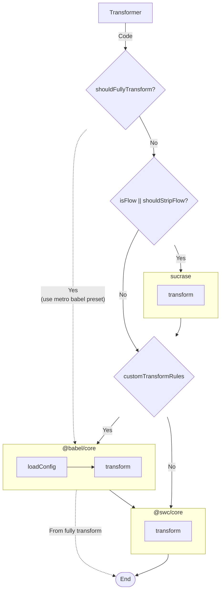
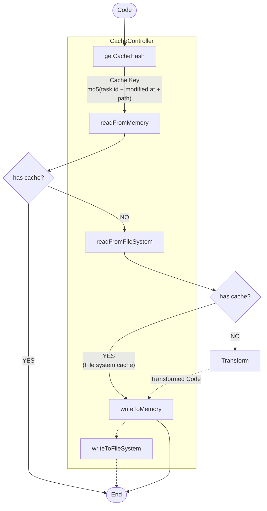

# Welcome to React Native Esbuild

  
  

  
   
React Native Esbuild is the Esbuild based bundler for React Native. 
Developed by <a href="https://github.com/leegeunhyeok">Geunhyeok LEE (@leegeunhyeok)</a>

## Highlights

- ⚡️ Blazing Fast Build
- 🌳 Support Tree Shaking
- 💾 In-memory & Local File System Caching
- 🎨 Flexible & Extensible
- 🔥 Support Hermes Runtime
- 🔄 Support Live Reload
- 🐛 Support Debugging(Flipper, Chrome Debugger)
- ✨ New Architecture Ready

## Architecture

- [Esbuild](https://esbuild.github.io): for transform source and bundling (minify, mangle, tree shaking)
- [Swc](https://swc.rs): for transform source to es5
- [Sucrase](https://github.com/alangpierce/sucrase): for strip flow syntax
- [Babel](https://babeljs.io): for transform with plugins

Transformer

Cache

